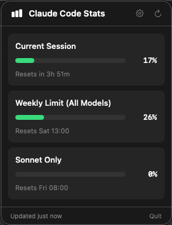

# Claude Code Stats

A native macOS menu bar app that displays your Claude Code usage limits in real-time.



## Features

- **Real-time usage data** - Shows your actual usage from Anthropic's servers
- **Current Session** - 5-hour rolling window usage with reset countdown
- **Weekly Limits** - All models combined usage with reset time
- **Sonnet Only** - Separate tracking for Sonnet model usage
- **Auto-refresh** - Updates every 5 minutes automatically
- **Native macOS app** - Built with SwiftUI, lightweight and fast
- **Dark theme** - Matches macOS menu bar aesthetic

## Requirements

- macOS 14.0 (Sonoma) or later
- Active Claude Pro/Max subscription
- Claude Code installed and logged in

## Installation

### Option 1: Build from Source

1. Clone the repository:
   ```bash
   git clone https://github.com/yourusername/claude-code-stats.git
   cd claude-code-stats
   ```

2. Open in Xcode:
   ```bash
   open ClaudeCodeStats/ClaudeCodeStats.xcodeproj
   ```

3. Build and run (⌘R)

### Option 2: Download Release

Download the latest `.app` from the [Releases](https://github.com/dmelo/claude-code-stats/releases) page and drag it to your Applications folder.

## Setup

1. Launch the app - a chart icon will appear in your menu bar
2. Click the icon, then click **⚙️** (settings) or **"Configure Session"**
3. Get your session cookie from claude.ai:
   - Open https://claude.ai in your browser
   - Open Developer Tools (`Cmd + Option + I`)
   - Go to **Application** → **Cookies** → **https://claude.ai**
   - Find `sessionKey` and copy its value
4. Paste the value in the app and click **Save**

## Usage

Click the menu bar icon to see your current usage:

| Metric | Description |
|--------|-------------|
| **Current Session** | Usage in the current 5-hour window |
| **Weekly Limit** | Combined usage across all models (resets weekly) |
| **Sonnet Only** | Sonnet-specific usage tracking |

The progress bars change color based on usage:
- 🟢 Green: 0-50%
- 🟡 Yellow: 50-75%
- 🔴 Red: 75-100%

## Start at Login

To launch automatically when you log in:

1. Open **System Settings** → **General** → **Login Items**
2. Click **+** and add ClaudeCodeStats

## Session Cookie Expiration

The claude.ai session cookie expires periodically. When you see an "unauthorized" error:

1. Click the ⚙️ icon
2. Get a fresh `sessionKey` from claude.ai (see Setup step 3)
3. Paste and save

## Building

```bash
cd ClaudeCodeStats
xcodebuild -project ClaudeCodeStats.xcodeproj -scheme ClaudeCodeStats -configuration Release build
```

The built app will be in `~/Library/Developer/Xcode/DerivedData/ClaudeCodeStats-*/Build/Products/Release/`

## Project Structure

```
ClaudeCodeStats/
├── ClaudeCodeStats.xcodeproj
└── ClaudeCodeStats/
    ├── ClaudeCodeStatsApp.swift    # App entry point
    ├── ContentView.swift            # Main popover view
    ├── Models/
    │   └── UsageData.swift          # Data models
    ├── Services/
    │   ├── WebSessionService.swift  # Claude.ai API client
    │   ├── KeychainService.swift    # Keychain access
    │   └── LocalStatsService.swift  # Local stats fallback
    └── Views/
        ├── UsageCardView.swift      # Usage card component
        ├── ProgressBarView.swift    # Progress bar component
        └── SettingsView.swift       # Settings screen
```

## Privacy

- Your session cookie is stored locally in UserDefaults
- The app only communicates with claude.ai to fetch your usage data
- No data is sent to any third parties

## License

MIT License - see [LICENSE](LICENSE) for details

## Acknowledgments

- Built for use with [Claude Code](https://docs.anthropic.com/en/docs/claude-code) by Anthropic
- Inspired by the Warp terminal menu bar design
