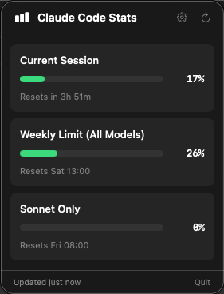

# Claude Code Stats

A native macOS menu bar app that displays your Claude Code usage limits in real-time.



## Features

- **Real-time usage data** - Shows your actual usage from Anthropic's servers
- **Current Session** - 5-hour rolling window usage with reset countdown
- **Weekly Limits** - All models combined usage with reset time
- **Auto-refresh** - Updates every 5 minutes automatically
- **Claude service status** - Live status from [status.claude.com](https://status.claude.com) shown in the footer (Operational, Degraded, Outage, Critical)
- **Version update detection** - Checks for new Claude Code releases hourly via GitHub; shows a red dot badge on the menu bar icon and a banner when an update is available, with a link to the changelog
- **Native macOS app** - Built with SwiftUI, lightweight and fast
- **Light/dark theme** - Adapts to macOS appearance

## Requirements

- macOS 14.0 (Sonoma) or later
- Active Claude Pro/Max subscription
- Claude Code installed and logged in

## Installation

### Option 1: Homebrew (Recommended)

```bash
brew tap dmelo/tap
brew install --cask claude-code-stats
```

### Option 2: Download Release

Download the latest `.app` from the [Releases](https://github.com/dmelo/claude-code-stats/releases) page and drag it to your Applications folder.

### Option 3: Build from Source

1. Clone the repository:
   ```bash
   git clone https://github.com/dmelo/claude-code-stats.git
   cd claude-code-stats
   ```

2. Open in Xcode:
   ```bash
   open ClaudeCodeStats/ClaudeCodeStats.xcodeproj
   ```

3. Build and run (⌘R)

## Setup

1. Make sure Claude Code is installed and you're logged in (`claude` in your terminal)
2. Launch the app - a chart icon will appear in your menu bar
3. Click the icon to see your usage data

The app reads your OAuth credentials from `~/.claude/.credentials.json` (created automatically when you log in to Claude Code). No manual configuration needed.

## Usage

Click the menu bar icon to see your current usage:

| Metric | Description |
|--------|-------------|
| **Current Session** | Usage in the current 5-hour window |
| **Weekly Limit** | Combined usage across all models (resets weekly) |

The progress bars change color based on usage:
- 🟢 Green: 0-50%
- 🟡 Yellow: 50-75%
- 🔴 Red: 75-100%

## Start at Login

To launch automatically when you log in:

1. Open **System Settings** → **General** → **Login Items**
2. Click **+** and add ClaudeCodeStats

## Building

```bash
cd ClaudeCodeStats
xcodebuild -project ClaudeCodeStats.xcodeproj -scheme ClaudeCodeStats -configuration Release build
```

The built app will be in `~/Library/Developer/Xcode/DerivedData/ClaudeCodeStats-*/Build/Products/Release/`

## Project Structure

```
ClaudeCodeStats/
├── ClaudeCodeStats.xcodeproj
└── ClaudeCodeStats/
    ├── ClaudeCodeStatsApp.swift    # App entry point
    ├── ContentView.swift            # Main popover view
    ├── Services/
    │   ├── OAuthUsageService.swift  # Anthropic API usage via OAuth
    │   ├── StatusService.swift      # Claude service health status
    │   └── VersionService.swift     # Claude Code version update checker
    └── Views/
        ├── UsageCardView.swift      # Usage card component
        ├── ProgressBarView.swift    # Progress bar component
        └── SettingsView.swift       # Settings screen
```

## Privacy

- The app reads OAuth credentials from `~/.claude/.credentials.json` (no secrets are stored by the app itself)
- The app communicates with the Anthropic API to fetch usage data, status.claude.com for service health, and the GitHub API for version checks
- No data is sent to any third parties

## License

MIT License - see [LICENSE](LICENSE) for details

## Acknowledgments

- Built for use with [Claude Code](https://docs.anthropic.com/en/docs/claude-code) by Anthropic
- Inspired by the Warp terminal menu bar design
