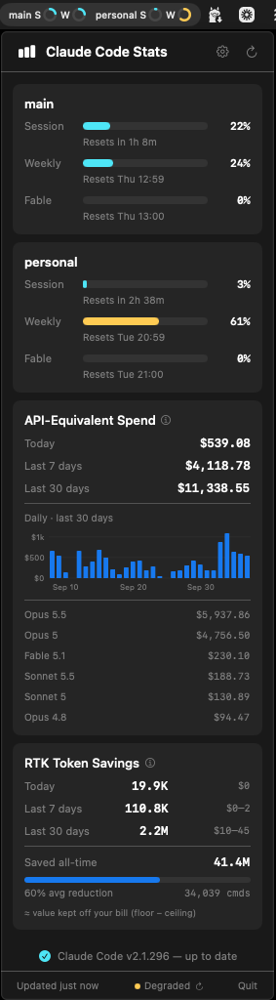

# Claude Code Stats

A native macOS menu bar app that displays your Claude Code usage limits in real-time.



## Features

- **Real-time usage data** - Shows your actual usage from Anthropic's servers
- **Current Session** - 5-hour rolling window usage with reset countdown
- **Weekly Limits** - All models combined usage with reset time, plus any per-model weekly limit your plan has (e.g. Fable)
- **Menu bar rings** - Optional session (S), weekly (W) and Fable (F) rings drawn right in the menu bar, coloured by how close each limit is
- **Multiple accounts (aimux)** - If you switch between Claude subscriptions with [aimux](https://github.com/Digital-Threads/aimux), every Claude profile gets its own limits in the popover and its own named rings in the menu bar — see [Multiple accounts](#multiple-accounts-aimux)
- **API-equivalent spend** - What your token usage would have cost at API rates: today, the last 7 days, and the last 30 days, with a per-model breakdown and a 30-day chart you can hover for any day's figure. Read from Claude Code's own transcripts on disk, so it needs no extra tooling and makes no network calls
- **RTK savings** - If you run your dev commands through RTK (Rust Token Killer), shows how many tool-output tokens it kept out of Claude Code's context: today, the last 7 days, and the last 30 days, plus a lifetime total, an average-reduction meter, and an API-equivalent value range. The range spans a conservative floor (each saved token priced once) and an optimistic ceiling (adding the re-billing an unfiltered result would incur, scaled by your own observed cache re-read rate). Read from RTK's local history database, so it appears only when RTK is installed and makes no network calls
- **Auto-refresh** - Updates every 5 minutes automatically
- **Claude service status** - Live status from [status.claude.com](https://status.claude.com) shown in the footer (Operational, Degraded, Outage, Critical)
- **Version update detection** - Checks for new Claude Code releases hourly via GitHub; shows a red dot badge on the menu bar icon and a banner when an update is available, with a link to the changelog
- **Native macOS app** - Built with SwiftUI, lightweight and fast
- **Light/dark theme** - Follows macOS appearance, or pin it to Light or Dark in Settings

## Requirements

- macOS 14.0 (Sonoma) or later
- Active Claude Pro/Max subscription
- Claude Code installed and logged in

## Installation

### Option 1: Homebrew (Recommended)

```bash
brew tap dmelo/tap
brew install --cask claude-code-stats
```

### Option 2: Download Release

Download the latest `.app` from the [Releases](https://github.com/dmelo/claude-code-stats/releases) page and drag it to your Applications folder.

### Option 3: Build from Source

1. Clone the repository:
   ```bash
   git clone https://github.com/dmelo/claude-code-stats.git
   cd claude-code-stats
   ```

2. Open in Xcode:
   ```bash
   open ClaudeCodeStats/ClaudeCodeStats.xcodeproj
   ```

3. Build and run (⌘R)

## Setup

1. Make sure Claude Code is installed and you're logged in (`claude` in your terminal)
2. Launch the app - a chart icon will appear in your menu bar
3. Click the icon to see your usage data

The app reads your OAuth credentials from `~/.claude/.credentials.json` or the macOS Keychain (created automatically when you log in to Claude Code). No manual configuration needed. Keychain logins are read through macOS's own `security` tool, which Claude Code's Keychain items already trust, so there is no permission prompt — not on first launch and not after updates.

To show rings in the menu bar instead of the chart icon, open Settings (the gear in the popover) and turn on any of **Menu Bar Display**'s toggles.

## Multiple accounts (aimux)

[aimux](https://github.com/Digital-Threads/aimux) runs Claude Code under several subscriptions, one config directory per profile. Claude Code Stats picks this up on its own — there is nothing to configure:

- **Profiles** are read from `~/.aimux/config.yaml` on every refresh, so a profile you add or remove in aimux shows up (or disappears) within one refresh. Only `cli: claude` profiles are shown. Without aimux the app shows your single `~/.claude` login, exactly as before.
- **Each profile's login** is read from the Keychain item Claude Code keeps for that config directory, so every profile's limits come from its own account.
- **The popover** shows one card per profile, with session, weekly and per-model limits and their reset times.
- **The menu bar** draws each visible profile's rings after its name: `main S◯ W◯   personal S◯ W◯`. The S/W/F toggles apply to every profile. A profile whose plan has no Fable limit gets no F ring, and a profile whose login can't be read (expired, signed out) gets a dashed ring rather than a misleading 0%. With only one profile visible the name is left out.
- **Settings → aimux Profiles** lets you hide a profile from the menu bar and give it a shorter label (`main` → `m`), which helps on a crowded menu bar — on a notched MacBook, macOS silently hides items that don't fit.
- **An expired login** isn't refreshed by the app; its card tells you to run `aimux run <profile>`, which lets Claude Code refresh it.
- **Spend and RTK savings** are shown once, for all profiles together. aimux shares `projects/` (where the transcripts live) across profiles, and a transcript doesn't record which account produced it, so spend can't be split per profile.

## Usage

Click the menu bar icon to see your current usage:

| Metric | Description |
|--------|-------------|
| **Current Session** | Usage in the current 5-hour window |
| **Weekly Limit** | Combined usage across all models (resets weekly) |
| **Weekly Limit (model)** | A per-model weekly limit, when your plan has one (e.g. Fable) |

The progress bars and menu bar rings change color based on usage:
- Cyan: 0-50%
- Orange (amber in dark mode): 50-75%
- Purple: 75-100% — menu bar rings also get a center dot, so the top step reads without color

The ramp is chosen to stay distinguishable under every common form of color blindness and to keep 3:1 contrast in both light and dark mode (see [#29](https://github.com/dmelo/claude-code-stats/issues/29)).

## Start at Login

To launch automatically when you log in:

1. Open **System Settings** → **General** → **Login Items**
2. Click **+** and add ClaudeCodeStats

## Building

```bash
cd ClaudeCodeStats
xcodebuild -project ClaudeCodeStats.xcodeproj -scheme ClaudeCodeStats -configuration Release build
```

The built app will be in `~/Library/Developer/Xcode/DerivedData/ClaudeCodeStats-*/Build/Products/Release/`

## Project Structure

```
ClaudeCodeStats/
├── ClaudeCodeStats.xcodeproj
└── ClaudeCodeStats/
    ├── ClaudeCodeStatsApp.swift     # App entry point (MenuBarExtra)
    ├── ContentView.swift            # Main popover view
    ├── UsageViewModel.swift         # Usage, status, spend & RTK state
    ├── Models.swift                 # Data models and formatters
    ├── Theme.swift                  # Colors and appearance handling
    ├── UpdateChecker.swift          # Update-check state
    ├── Services/
    │   ├── AimuxService.swift       # aimux profile discovery & menu bar prefs
    │   ├── OAuthUsageService.swift  # Anthropic API usage via OAuth, per account
    │   ├── CostService.swift        # API-equivalent spend from transcripts
    │   ├── RTKSavingsService.swift  # RTK token savings from its local history
    │   ├── UsageHistoryService.swift# Usage history persistence
    │   ├── StatusService.swift      # Claude service health status
    │   └── VersionService.swift     # Claude Code version update checker
    └── Views/
        ├── UsageCardView.swift      # Usage card component
        ├── AccountUsageCardView.swift # Per-profile limits card (aimux)
        ├── ProgressBarView.swift    # Progress bar component
        ├── SpendCardView.swift      # API-equivalent spend card
        ├── SpendChartView.swift     # 30-day spend chart
        ├── RTKSavingsCardView.swift # RTK token savings card
        └── SettingsView.swift       # Settings screen
```

## Privacy

- The app reads OAuth credentials from `~/.claude/.credentials.json` or the macOS Keychain — for aimux, each profile's own Keychain item and `~/.aimux/config.yaml`. Tokens are held in memory only; the app never refreshes or writes back Claude Code's credentials. (Versions up to 0.13.0 cached a copy in a `ClaudeCodeStats-credentials` Keychain item; it is no longer read or written, and you can delete it in Keychain Access.)
- The app communicates with the Anthropic API to fetch usage data, status.claude.com for service health, and the GitHub API for version checks
- API-equivalent spend and RTK savings are computed entirely on your machine from Claude Code's transcripts and RTK's local history database — no network calls, and nothing about your usage leaves your device
- No data is sent to any third parties

## License

MIT License - see [LICENSE](LICENSE) for details

## Acknowledgments

- Built for use with [Claude Code](https://docs.anthropic.com/en/docs/claude-code) by Anthropic
- Inspired by the Warp terminal menu bar design
